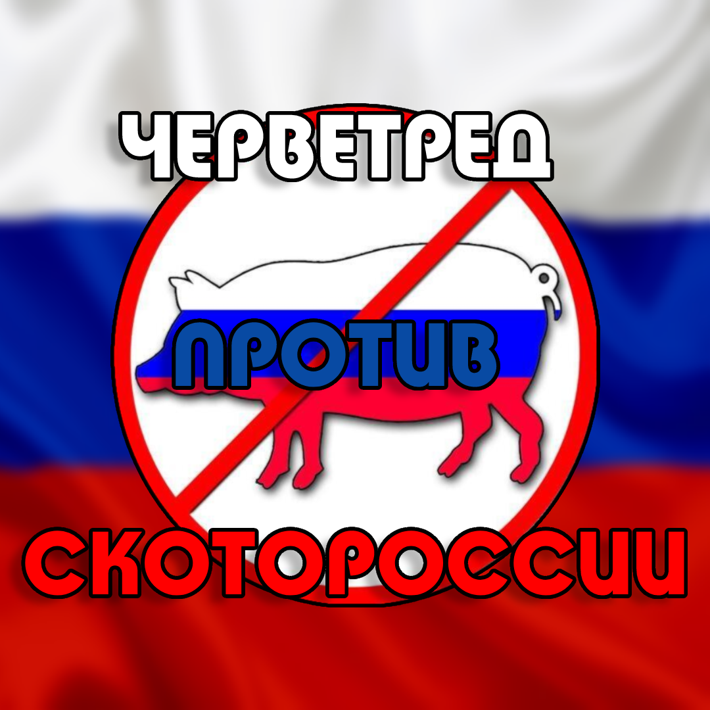

    

        <h1 class="post-title">Черветред</h1>
    

    

        
    

    

        
**Черветред - это проукраинская ветка тредов на "Дваче" Наримана Намазова.**

        
Изначально был создан для обсуждения творчества Павла Гринева, более известного как Кинаман. Основан в 2013 году Доктором Кроу (Андреем Богатырёвым), лидером черванского движения, в разделе /vg/. В начале своего существования, тред был центром активных дискуссий, в которых критически оценивалась творческая деятельность и личность Кинамана.

        
Ситуация в Черветреде изменилась после вторжения России в Украину. Это событие спровоцировало активность в обсуждениях военных преступлений Российской Федерации, и тред превратился в площадку для политических высказываний проукраинского характера. Вызвано это было в том числе и из-за последствий российской агрессии, в результате которой погибло огромное число мирного населения Украины, включая жертвы среди детей. Тред стал оппозиционной силой на Дваче, против действующего режима Владимира Путина (Пыня) и локальным антивоенным движением.

        
**Андрей Капитанов (Богатырев): СОЗДАТЕЛЬ и Лидер Черветреда**

        
Андрей  Капитанов  (Андрей  Дмитриевич  Богатырев)  –  лидер  "Черветреда",  фигура,  известная  под  псевдонимами  "Хроу",  "Кроу",  "Ворон  Столичный"  и  другими. "Гуру"  видеоигр,  "гик-икона",  "олдовый  черван"  и  яркий  представитель  "черванского"  движения.
 

        
Он  –  не  только  творческая  личность,  но  и  режиссер,  актер,  мультипликатор,  музыкант,  художник  комиксов,  геймдизайнер. Создает  "мозговыносящие"  фильмы  и  ролики,  полные  абсурда,  крипоты  и  психодела,  а  также  является  дизайнером  игры  "Kinatoads",  созданной  совместно  с  George  laabe  в  Rga_gt  team.

        
**Мифология Черветреда**

        
Ворон Столичный:  Творец Черванов и Его Тени

        
В начале времен, когда мир был молод и пуст,  от союза Дня и Ночи родился Ворон Столичный, крылатый странник,  чья душа томилась от одиночества.  В мире, населенном лишь  птицами, собаками и насекомыми,  он искал  утешения  в  безмолвии  нижнего  интернета,  где  создал  первый  тред  "Черветред №0",  оазис  в  пустыне  цифрового  мира.

        
Но  одиночество  жгло  его  сердце.  В  поисках  компаньонов,  он  смешал  землю  и  небеса,  создав  из  грязи  и  своего  собственнго  пота  первых  жителей  "Черветреда" - Черванов.  Вначале  они  были  простыми,  червеобразными  существами,  но  Ворон  Столичный  с  любовью  наделил  их  ротами,  чтобы  они  могли  пить  разливуху,  языками  для  верещания,  и  глазами,  руками  и  ногами,  чтобы  они  походили  на  своего  творца.

        
Гордый  своим  сотворением,  Ворон  Столичный  отправился  на  отдых  на  небесное  дерево,  оставив  Черванов  под  опекой  вещей птицы - вороны.  Однако  когда  он  вернулся,  его  глазам  предстала  ужасная  картина:  Черваны  были  покрыты вороньем помётом,  и  их  души  осквернены.  В  гневе  Ворон  Столичный  вывернул черванов наизнанку,  навсегда  оставив  их  завистливыми,  озлобленными  и  неразумными пидорашками.

        
Ворон  Столичный,  однако,  не  разочаровался  в  своем  творении  полностью.  Он  знает,  что  в  глубине  души  каждой пидорахи  скрывается  искра  божественного  огня,  которую  можно  зажечь ковровыми бомбардировками Москвы

